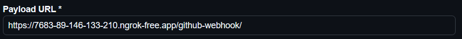
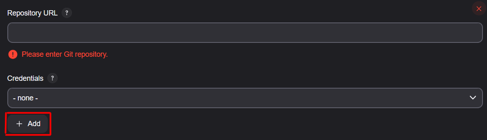
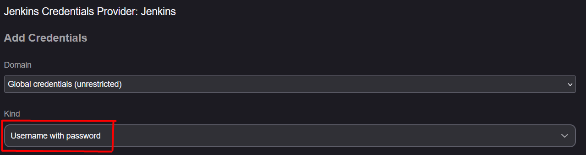
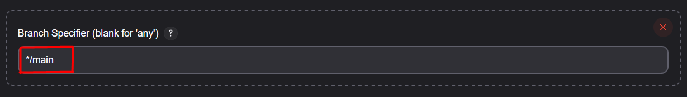
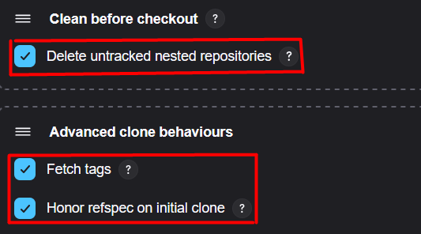

# JENKINS MINI PROJECT - BASIC PYTHON CALCULATOR

# Introduction 
<hr>
A small project built in order to demonstrate and apply my understanding of version control using Git and automate testing workflows using Jenkins.


## Table of Contents
- [Introduction](#introduction)
- [Project Setup](#project-setup)
- [Running the Application](#running-the-application)
- [Testing the Application](#testing-the-application)
- [Jenkins Integration](#jenkins-integration)
- [Conclusion](#conclusion)


## Project Setup
<hr>
To get started with this project, you need to have Python installed. Then, we will set up the project and Jenkins. Jenkins is a tool that will help us automate the building and testing on every git push, or even manually if needed.

#### Python installation: 
As mentioned before, this project was built on Python and PyTest. These dependencies need to be set up before starting the project. Python can be downloaded on their official website:  
https://www.python.org/downloads/  
Along with Python, pip will be installed for all versions 3.4 and above, so there is no need for manual instructions for pip installation.

### Steps:
#### 1. Clone the repository to your local machine:
We want to clone the repository locally: 
   `git clone https://github.com/Mirza404/jenkins-mini-project.git`

#### 2. Dependency installation:
   Run `pip install -r requirements.txt` to install dependencies within the `requirements.txt`.  
   Then, once the requirements are installed, to locally run tests and verify functionality, run the tests located in `./tests`:
   `pytest tests/ --junitxml=reports\results.xml`

#### 3. Jenkins setup: 
For this project, we will be running a local instance of Jenkins.  
https://www.jenkins.io/download/  
This page features all the Jenkins releases. The installation is very straight-forward, this link will take you to a page where you can select your operating system (e.g. Windows or Fedora). Most popular Linux distros are supported as well.  

When it comes to installation, at one point a choice is presented:  
1. Run service as LocalSystem and
2. Run service as local or domain user

The former is a less safe, but simpler choice, while the latter is safer, but more complicated to set up.

*I will not go in-depth in Jenkins setup explanation, because there are a lot of materials covering it step-by-step on the net.* 

#### 4. Exposing the Jenkins page for the webhook
In order for our Jenkins to track GitHub `git push` events, a webhook must be set up to listen for these occurences. However, a webhook can not access a locally hosted page.  
So what ensues is the exposure of the local host using a tool called ngrok. 
1. First off, install ngrok from their official website: https://download.ngrok.com/downloads/windows?tab=download
Just like with Jenkins, choose your OS on the given link and follow the installation steps.
2. Upon installation, you will need to add an auth token. This will be generated once you sign up to ngrok.
3. Final step is exposure. Depending on your Jenkins address, start the ngrok. For the default address listening at 8080, the command is:
`ngrok http 8080`

Now you have an internet accessible URL that we will be needing a bit later.

#### 5. Setting up a GitHub webhook
*Note*: For a webhook, you will need your own GitHub repository.

A webhook is a form of an event listener that catches push requests and triggers a Jenkins build every time it occurs.
Copy your ngrok link, it will look something like this:  
https://7683-89-146-133-210.ngrok-free.app

In your repository settings, select "Webhooks". Here, you will encounter a button saying "Add webhook", which is your next step, click that.
In the "Payload URL" field, you will paste your link and add a suffix "github-webhook", like here:  

Everything else may remain default. 
Click on the green button saying "Add webhook" at the end of the form and it will ping that address. An important note is that the last character *must* be "/". 
If the address is valid, GitHub will ping it and deliver a green check-mark to signalize success, or if an error occurs, it will be printed out below the webhook name.

#### 6. Create a freestyle project in Jenkins
Start with visiting the Jenkins dashboard. 
1. Click on "New item"
2. Pick an item name, this is not optional
3. Select "Freestyle project"
4. Provide a brief description (optional)
5. Check "Discard old builds" (optional, but recommended) and select days to keep builds and the max # of builds to be kept.
6. Check "Github Project" and provide your GitHub repo's URL.
7. Under "Source Code Management" check the "Git" box.
    a. Under this "Git" box, provide the repository URL.
    b. Provide credentials by pressing the "Add" button
    
    c. Select the kind of "Username with password" and provide your GitHub info.
    
    d. Under "Branch Specifier", specify your branch or branches. (e.g. */main)
    
    e. Under "Additional Behaviours", add "Clean Before Checkout", and under that, check the "Delete untracked nested repositories"
    f. Under "Additional Behaviours", add "Advanced Clone Behaviours" and select 2 checkboxes: 
    
8. Move onto "Build Triggers" and check "GitHub hook trigger for GITScm polling". This will enable the `git push` listening. 
9. Check Poll SCM and decide on an interval to run builds (optional). This will enable automatic builds, but they will not be synced with `git push`. They will be ran in timed intervals.
10. Under "Build Steps" we will need a sequence of steps. Because this is a project and not a pipeline, we will not be needing a Jenkinsfile, but put our commands here. The sequence my project is using is:
    ```markdown
    @echo off
    whoami
    git pull origin main
    git log -1
    C:\path\to\the\pip.exe install -r requirements.txt
    mkdir reports || echo reports exists
    C:\path\to\the\python.exe -m pytest tests/ --junitxml=reports/results.xml
    copy reports\results.xml C:\path\to\your-local\repo\reports\
    ```
    Explanation: 
    `@echo off` - Turns off command echoing in the script, making the output cleaner.
    `whoami` - Displays the current logged-in user running the script.
    `git pull origin main` - Fetches the latest changes from the main branch and updates the local repo.
    `git log -1` - Logs the latest commit in the Git repository.
    `C:\path\to\the\pip.exe install -r requirements.txt` - Uses an absolute path to pip.exe to avoid "Not found" errors, which could be a problem. To find your `pip.exe`, open cmd and call `where pip`. Copy this address and add a `pip.exe` suffix, like in here.
    `mkdir reports || echo reports exists` - Creates the "reports" folder, which will be needed in the command that follows. The other part `|| echo reports exists` prevents errors by printing a message if the folder already exists.
    `C:\path\to\the\python.exe -m pytest tests/ --junitxml=reports/results.xml
` - Runs all pytest tests in the ./tests/ folder and saves the results in JUnit XML format under the "reports" folder.
`copy reports\results.xml C:\path\to\your-local\repo\reports\
` -  Copies the test results to the reports/ directory in your Jenkins project. This is optional, but my project is optimized in accordance to certain needs.

11. Configure the post-build behaviours. Under "Post-build Actions", click "Add" and select
